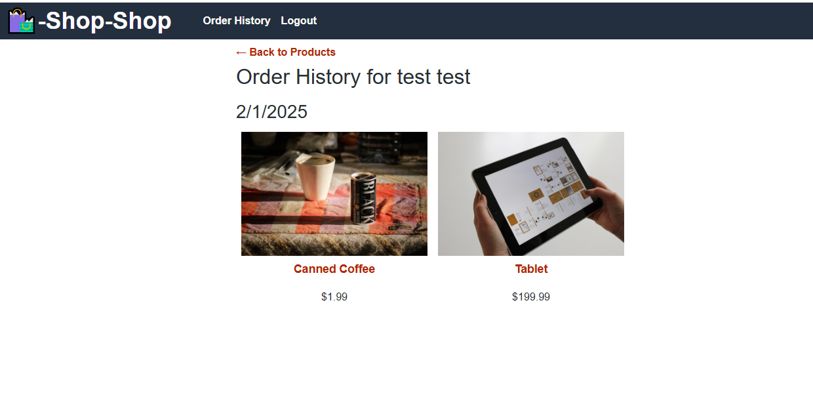

# React/Redux Store

This is a React-based online story using Redux for state management, Apollo Client for interacting with a GraphQL API, and JWT authentication. 

## Features

- **User Authentication**: Login, signup, and logout functionality.
- **Redux for State Management**: Store global states such as user, products, and cart.
- **Apollo Client**: Fetches product data and handles GraphQL queries and mutations.
- **Shopping Cart**: Add products to cart, update quantities, and manage cart items.
- **Product Management**: View, add, update, and remove products from the platform.

## Installation

### 1. **Clone the repository**:
   ```bash
   git clone git@github.com:jesseswanton/redux-store.git
   ```

### 2. Use npm install in your client and server folders.

### 3. Use npm develop in your root folder to run the client and server concurrently.

## Usage

Sign up to create a new account or log in.


Use the category buttons to filter by category of item.


Click "Add to cart" to add items to your shopping cart and shows you a total


Checkout takes you to Stripe for processing (user credit card 4111 11... for testing)


After checkout, your order history will be updated.



Deployed application:
